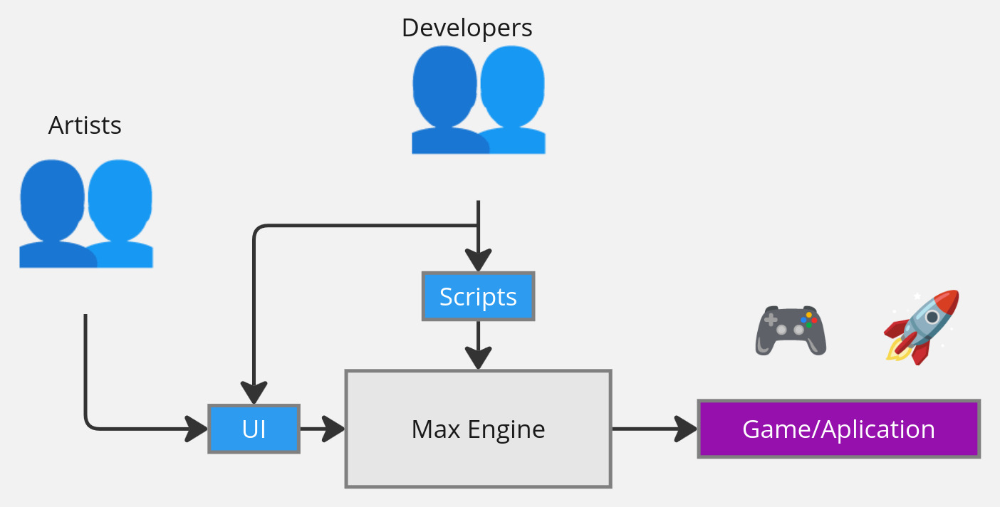

# Getting started

In this markdown is explainded the basis of the Max Engine architecture.

Introduction:

- [0](#what-is-a-game-engine) - What is a game engine?
- [1](#game-engine-components) - Game engine components.

## What is a game engine.

A game engine is the tool that allows game developers to desing and create games. Concidere a game engine as a black box where the inputs are 3D models, textures, lighting, scripts, etc and the output is the game.

 

The image avobe shows the blackbox with its relative inputs and outputs. We can see how we probably need extra tolling like UI and scripting that is not necessarily attached to the main black box. In the next chapters we will comment these topics and explain how we should aproach to implement these features.

## Game engine components.

