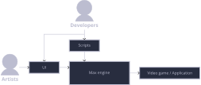

# Architecture

This following section goes over Max's architecture. But in order to understand
Max's layout, we must first understand some key concepts.

## What is a game engine?

A game engine is the tool that allows game developers and artists to design and
create video games. Think of a game engine as a black box where the inputs are
assets and scripts and the output is a video game or application.

>  
> The image above shows the black box with its inputs and outputs. Notice how
there's extra tooling like a user interface that's not necessarily attached to
the main black box.

## Components
